# DrQuick – Smart Doctor Appointment Booking System

DrQuick is a PHP & MySQL-based web application for managing doctor-patient appointments. It allows patients to search for doctors, book appointments, and track status, while doctors can manage schedules and approve bookings.

---

## Features

### Patient Module
- Register and log in as a patient
- Search for doctors by name or specialization
- View doctor profiles and available schedules
- Book appointments with real-time confirmation
- View appointment history and status

### Doctor Module
- Register and log in as a doctor
- Manage available schedules
- View all appointments and approve or cancel requests
- Profile management

### General
- Role-based authentication (Patient/Doctor)
- Secure password hashing and session management
- Responsive design with intuitive UI

---

## Folder Structure

```

DrQuick/
├─ admin/
├─ assets/
│  ├─ css/
│  └─ fontawesome/
├─ auth/
├─ config/
├─ doctor/
├─ patient/
├─ .gitignore
├─ index.php
├─ README.md
└─ .htaccess

````

---

## Installation

1. Clone the repository:

```bash
git clone https://github.com/N-Amasha/DrQuick.git
````

2. Move the project folder to your local web server directory (e.g., `htdocs` for XAMPP).

3. Create a MySQL database (e.g., `drquick`) and import the SQL schema from the `database.sql` file.

4. Update database configuration in `config/db.php`:

```php
<?php
$host = "localhost";
$user = "root";
$pass = "";
$db = "drquick";

$conn = mysqli_connect($host, $user, $pass, $db);
if (!$conn) {
    die("Connection failed: " . mysqli_connect_error());
}
?>
```

5. Open the app in your browser:

```
http://localhost/DrQuick/
```

---

## Technologies Used

* PHP 8+
* MySQL / MariaDB
* HTML5, CSS3, JavaScript
* FontAwesome icons
* XAMPP or WAMP for local development

---

## Screenshots

### Homepage
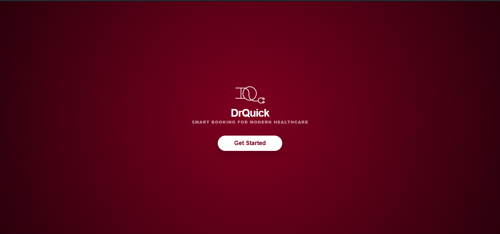

### User Login
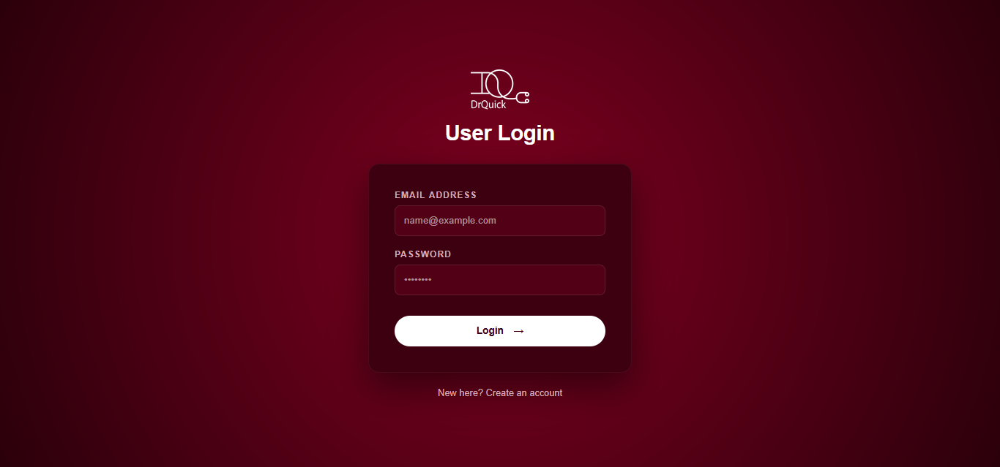

### User Register
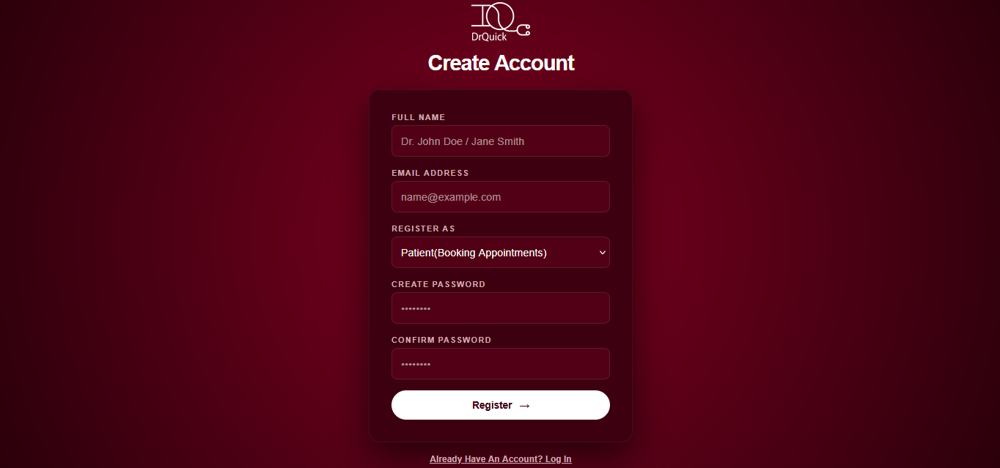

### Doctor Dashboard
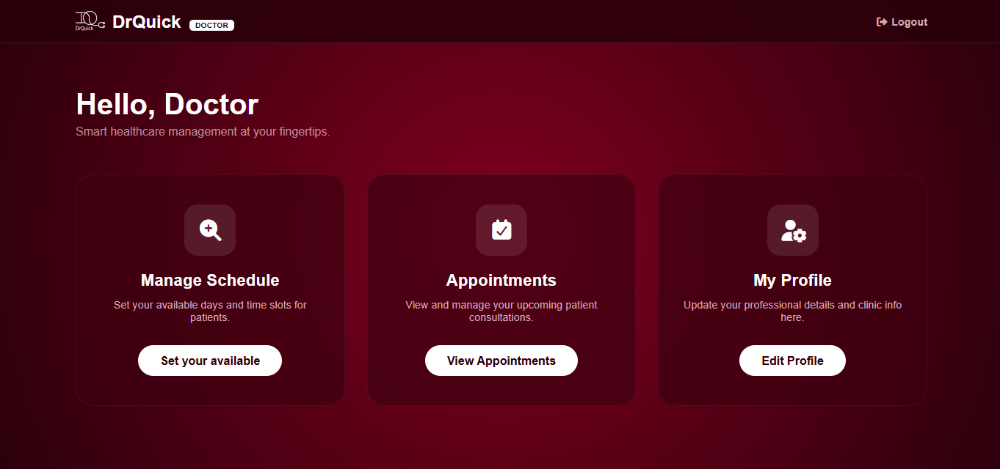

### Doctor Manage Schedule
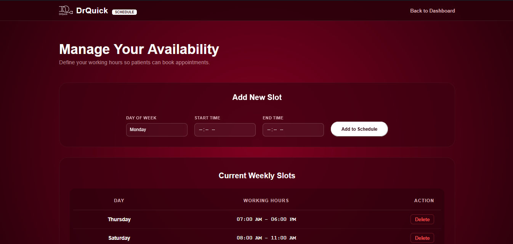

### Doctor Appointement
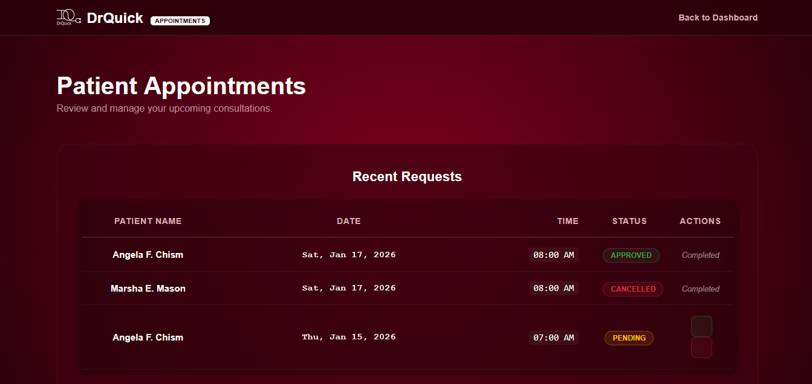

### Doctor User Profile
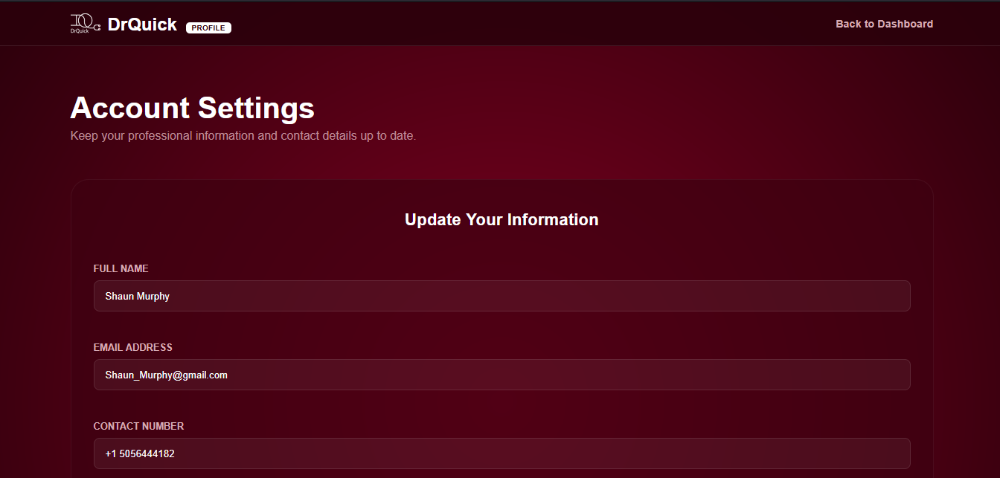
.png)

### Patient Dashboard
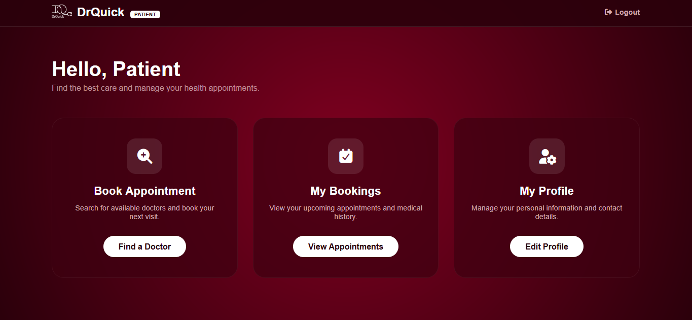

### Patient Book Appointement - Search Doctors
.png)
.png)

### Patient Select Appointement Time
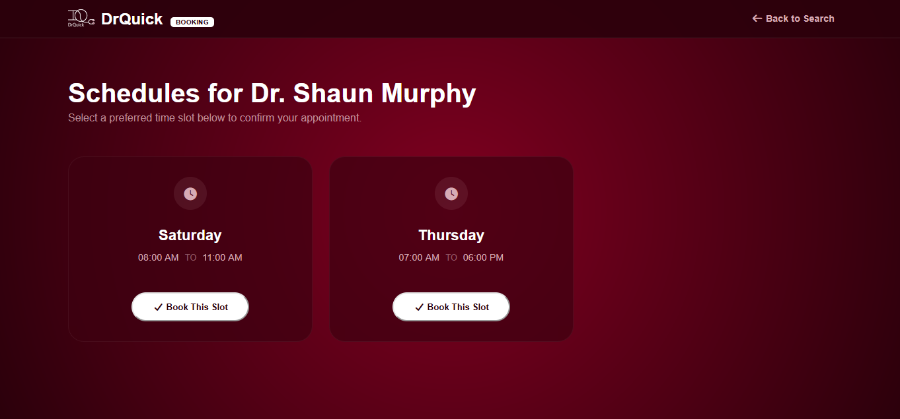

### Patient Appointement
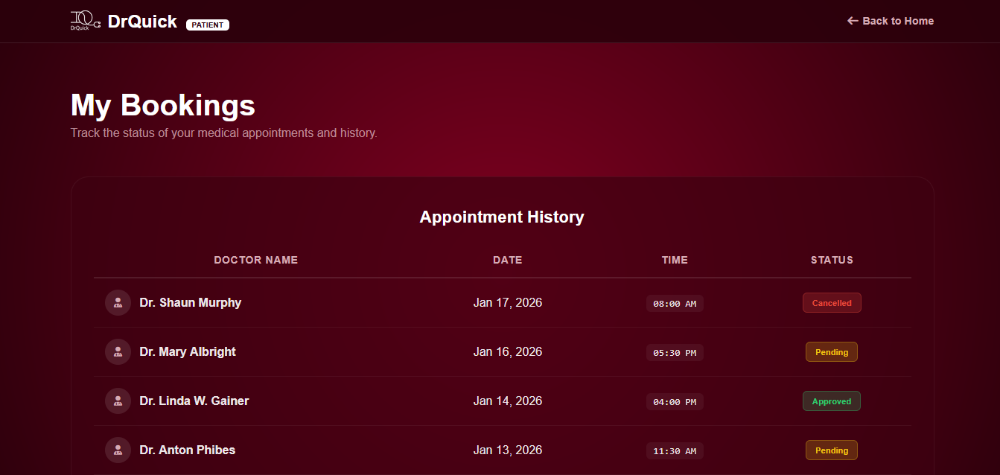
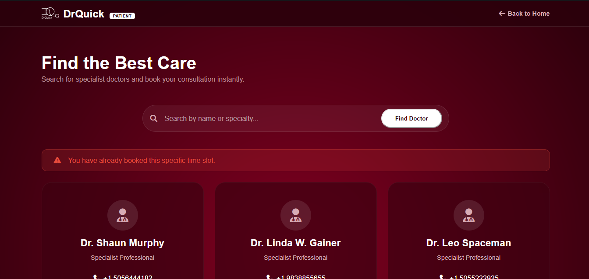

### Patient User Profile
.png)
.png)
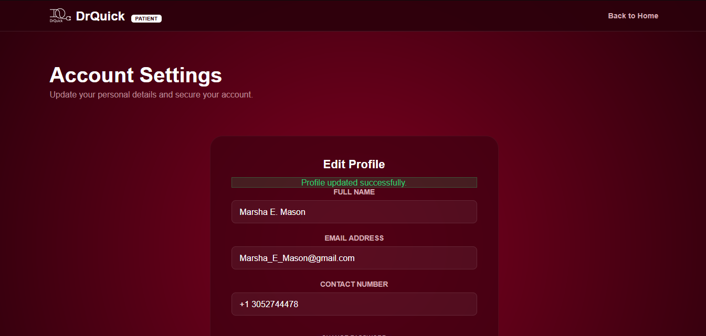

---

## Future Enhancements

* Email/SMS notifications for appointment confirmations
* Calendar integration for doctors
* Multi-language support
* AI-based doctor recommendation system

---

## Author

**Nethmi Amasha**